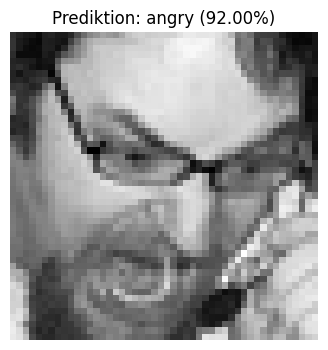

# Facial Expression Recognition med CNN

<p align="center">
  
  
  
  

</p>

Ett deep learning-projekt där ett **Convolutional Neural Network (CNN)** tränas för att klassificera ansiktsuttryck från gråskalebilder. Projektet är gjort som en individuell inlämningsuppgift och fungerar både som kod, experiment och kort rapport.

Modellen tränas på bilder i storleken **48 × 48 pixlar** och klassificerar ansikten i sju känsloklasser:

`angry`, `disgust`, `fear`, `happy`, `neutral`, `sad`, `surprise`

---

## Innehållsförteckning

- [Projektets mål](#-projektets-mål)
- [Dataset](#-dataset)
- [Projektstruktur](#-projektstruktur)
- [Installation](#️-installation)
- [Så körs projektet](#️-så-körs-projektet)
- [Modeller](#️-modeller)
- [Resultat](#-resultat)
- [Utvärdering](#-utvärdering)
- [Exempel på prediktion](#-exempel-på-prediktion)
- [Datakvalitet](#-datakvalitet)
- [Slutsats](#-slutsats)
- [Sparade modeller](#-sparade-modeller)
- [Möjliga förbättringar](#-möjliga-förbättringar)
- [Författare](#-författare)

---

## 📌 Projektets mål

Målet med arbetet är att undersöka hur CNN-modeller kan användas för bildklassificering av ansiktsuttryck. Projektet jämför flera modeller med olika komplexitet för att se hur arkitektur, regularisering och data augmentation påverkar resultatet.

I arbetet ingår bland annat:

- inläsning och analys av bilddata
- hantering av obalanserade klasser med `class_weight`
- träning av flera CNN-modeller
- användning av dropout, batch normalization och data augmentation
- jämförelse av tränings-, validerings- och testresultat
- analys med confusion matrix och classification report
- prediktion på en enskild testbild
- reflektion kring overfitting, datakvalitet och förbättringsmöjligheter

---

## 🧠 Dataset

Datasetet består av gråskalebilder med ansiktsuttryck. Bilderna är uppdelade i mapparna `train/` och `test/`, där varje klass har en egen undermapp.

Fördelningen i datasetet är:

| Klass | Träning | Test | Totalt |
|---|---:|---:|---:|
| angry | 3 995 | 958 | 4 953 |
| disgust | 436 | 111 | 547 |
| fear | 4 097 | 1 024 | 5 121 |
| happy | 7 215 | 1 774 | 8 989 |
| neutral | 4 965 | 1 233 | 6 198 |
| sad | 4 830 | 1 247 | 6 077 |
| surprise | 3 171 | 831 | 4 002 |

Totalt används:

- **28 709 träningsbilder**
- **7 178 testbilder**
- **7 klasser**

Datasetet är obalanserat. Klassen `happy` har flest bilder, medan `disgust` har klart minst antal bilder. Därför används `class_weight` under träningen för att minska risken att modellen favoriserar de vanligaste klasserna.

> Dataset-mapparna `train/` och `test/` ingår inte i repot eftersom de är stora. De ska placeras i projektets rotmapp innan notebooken körs.

---

## 🗂️ Projektstruktur

```text
facial-expression-recognition-cnn-main/
├── README.md
├── fer_deep_learning_inlamning.ipynb   # Notebook med kod, rapport och analys
├── requirements.txt                    # Python-beroenden
├── best_fer_model.keras                # Sparad bästa modell
├── assets/
│   └── prediction-angry.png            # Exempelbild från prediktion
├── models/
│   ├── 01_baseline_cnn.keras
│   ├── 02_regularized_cnn.keras
│   └── 03_deeper_cnn.keras
├── train/                              # Läggs till lokalt
│   ├── angry/
│   ├── disgust/
│   ├── fear/
│   ├── happy/
│   ├── neutral/
│   ├── sad/
│   └── surprise/
└── test/                               # Läggs till lokalt
    ├── angry/
    ├── disgust/
    ├── fear/
    ├── happy/
    ├── neutral/
    ├── sad/
    └── surprise/
```

---

## ⚙️ Installation

### 1. Klona eller ladda ner projektet

```bash
git clone <repo-url>
cd facial-expression-recognition-cnn-main
```

### 2. Skapa en virtuell miljö

Windows:

```bash
python -m venv .venv
.venv\Scripts\activate
```

macOS/Linux:

```bash
python -m venv .venv
source .venv/bin/activate
```

### 3. Installera beroenden

```bash
pip install -r requirements.txt
```

De viktigaste biblioteken som används är:

- TensorFlow / Keras
- NumPy
- Pandas
- Matplotlib
- scikit-learn
- Pillow

---

## ▶️ Så körs projektet

1. Lägg datasetet i projektmappen så att mapparna `train/` och `test/` ligger bredvid notebooken.
2. Öppna notebooken:

```bash
jupyter notebook fer_deep_learning_inlamning.ipynb
```

eller öppna den direkt i VS Code.

3. Kör cellerna uppifrån och ned.

Notebooken kontrollerar automatiskt att mapparna `train/` och `test/` finns. Om de saknas stoppas körningen med ett tydligt felmeddelande.

---

## Modeller

Tre olika CNN-modeller testas och jämförs.

### 1. Baseline CNN

En enklare startmodell med två convolution-block, max pooling, dense-lager och dropout. Syftet är att skapa en grundnivå att jämföra de mer avancerade modellerna mot.

### 2. Regularized CNN

En starkare CNN med:

- data augmentation
- fler convolution-lager
- batch normalization
- dropout
- global average pooling

Denna modell är byggd för att minska overfitting och generalisera bättre än baseline-modellen.

### 3. Djupare CNN

Den bästa modellen i projektet. Den använder fler convolution-block och fler filter för att lära sig mer avancerade visuella mönster i ansiktena, exempelvis ögon, munform och ansiktsdrag.

---

## 📊 Resultat

| Modell | Test accuracy | Test loss | Kommentar |
|---|---:|---:|---|
| Baseline CNN | 47,28 % | 1.393662 | Enkel modell som visar tydliga tecken på overfitting. |
| Regularized CNN | 56,80 % | 1.122438 | Bättre generalisering tack vare regularisering och augmentation. |
| Djupare CNN | 63,10 % | 0.980763 | Bästa modellen med högst test accuracy och lägst test loss. |

Den bästa modellen blev **03_deeper_cnn**, med:

- **test accuracy:** 63,10 %
- **test loss:** 0.980763
- **final training accuracy:** 64,32 %
- **final validation accuracy:** 62,55 %

Resultatet visar att den djupare modellen generaliserar relativt bra, eftersom skillnaden mellan tränings-, validerings- och testresultat är liten.

---

## 🔍 Utvärdering

Den bästa modellen utvärderas med både classification report och confusion matrix.

Modellen presterar bäst på tydliga uttryck som:

- `happy`
- `surprise`

Den har svårare med uttryck som ofta liknar varandra, till exempel:

- `fear`
- `sad`
- `neutral`

Detta är rimligt eftersom ansiktsuttryck kan vara visuellt lika, särskilt i små gråskalebilder på 48 × 48 pixlar.

---

## 🧪 Exempel på prediktion

Notebooken innehåller även en funktion för att testa modellen på en enskild bild:

```python
predicted_class, confidence, prob_df = predict_single_image(best_model, image_path)
```

I ett exempel predikterade modellen klassen **angry** med cirka **92 % säkerhet** på en testbild från klassen `angry`.



---

## 🧼 Datakvalitet

En extra kontroll görs för att hitta tekniskt misstänkta bilder, till exempel bilder med väldigt låg pixelvariation eller nästan enfärgade bilder.

Totalt hittades **39 misstänkta bilder**, vilket är väldigt få i förhållande till datasetets storlek. Slutsatsen är därför att dessa bilder troligen inte påverkar resultatet nämnvärt.

T.ex.


---

## 💭 Slutsats

Projektet visar att CNN-modeller kan klassificera ansiktsuttryck relativt bra även med små gråskalebilder. Den enkla baseline-modellen lärde sig vissa mönster men överanpassade tydligt. När modellen förbättrades med data augmentation, dropout, batch normalization och en djupare arkitektur ökade test accuracy från **47,28 %** till **63,10 %**.

Den djupare CNN-modellen gav bäst resultat, men tog också längst tid att träna. Ett möjligt nästa steg hade varit att testa transfer learning, mer avancerad augmentation eller en noggrannare rensning av otydliga bilder.

---

## 📦 Sparade modeller

Projektet innehåller sparade modeller i Keras-format:

```text
best_fer_model.keras
models/01_baseline_cnn.keras
models/02_regularized_cnn.keras
models/03_deeper_cnn.keras
```

`best_fer_model.keras` är den slutliga modellen som sparades efter träningen.

---

## 🚀 Möjliga förbättringar

Några rimliga förbättringar för framtida arbete:

- testa transfer learning med en modell som är anpassad för bildklassificering
- göra mer omfattande data augmentation för svåra klasser
- analysera felklassificerade bilder manuellt
- testa fler regulariseringsmetoder och learning rate-scheman
- spara träningshistorik och figurer som separata filer för enklare jämförelse

---

## 👤 Författare

Tim Rydén
